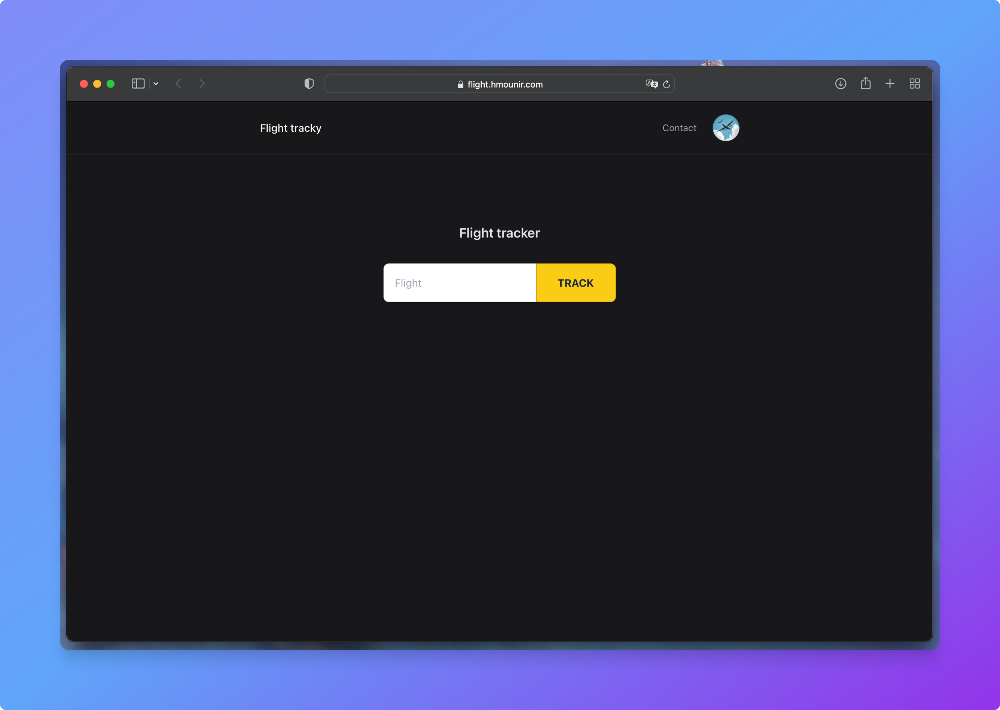
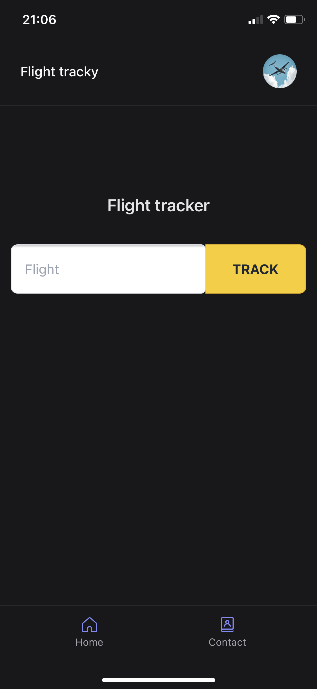

	
	<h2 align="center">Flight tracky</h2>
	
Flight tracker app

	
Base on a <a href="https://github.com/mvllow/next-pwa-template"><strong>template</strong></a>
 from <a href="https://github.com/mvllow"><strong>mvllow</strong></a>.

	<a href="https://flight-tracky.hmounir.com">Live demo</a>

  

	
	

  
Table of Contents

  <ol>
    <li>
      <a href="#about-the-project">About The Project</a>
      <ul>
        <li><a href="#built-with">Built With</a></li>
      </ul>
    </li>
    <li><a href="#roadmap">Roadmap</a></li>
    <li><a href="#contributing">Contributing</a></li>
    <li><a href="#license">License</a></li>
    <li><a href="#contact">Contact</a></li>
  </ol>

## About The Project

The idea was to create a simple web app that can be used as a template for next ideas. Also a good way to cuse other technologies.

### Built With

You can see here the major frameworks that was built with. Project is mainly frontend.

- [Nextjs](https://nextjs.org/)
- [Tailwindcss](https://tailwindcss.com/)
- [React](https://reactjs.org/)
- [Google Analitics](https://analytics.google.com/analytics/web/)

[Aviationstack](https://aviationstack.com) used for the aviation informations.

## Gallery

### Desktop

### Mobile

## Roadmap

- [x] Complete readme
- [x] Fix icons
- [x] Put api key in process env
- [x] Add GA
- [ ] Add theme switcher
- [ ] Basic SEO
- [x] Define color scheme
- [ ] Add blog entry for it + project on hmounir.com

## Contributing

Contributions are what make the open source community such an amazing place to be learn, inspire, and create. Any contributions you make are **greatly appreciated**.

1. Fork the Project
2. Create your Feature Branch (`git checkout -b feature/AmazingFeature`)
3. Commit your Changes (`git commit -m 'Add some AmazingFeature'`)
4. Push to the Branch (`git push origin feature/AmazingFeature`)
5. Open a Pull Request

## License

Distributed under the MIT License. See `LICENSE` for more information.

## Contact

Hamza Mounir - [@pixlhamza](https://twitter.com/pixlhamza) - hamza.pixelle@gmail.com
Project Link: [https://flight-tracky.hmounir.com](https://flight-tracky.hmounir.com)
